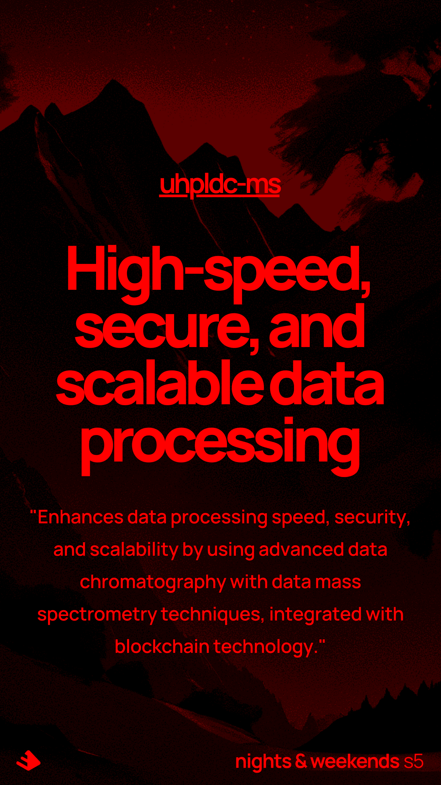

<!-- markdownlint-disable-next-line MD041 -->


**Big data processing based on first principles and system thinking.**

**U**ltra-**H**igh **P**erformance **L**iquid **D**ata **C**hromatography --with-- **M**ass **S**pectrometry

## Introduction

Azure + Synapse + LLMs + Corda = uhpldc-ms

For more details see the [Whitepaper](docs/whitepaper/whitepaper_to_be_pdf.md), [faq](docs/faq.md) and [docs](docs/).

## Prerequisites

Before you begin, ensure you have the following installed:

- [Azure CLI](https://docs.microsoft.com/en-us/cli/azure/install-azure-cli)

## Installation

Follow these steps to set up and deploy the infrastructure:

Ensure you are authenticated to Azure CLI before running the commands. You can authenticate using Azure Active Directory (Azure AD) or provide storage account credentials.

### Using azure resource manager (preferred)

1. **Open scripts/deploy and adjust the parameters**
2. **run the script**

```sh
./scripts/deploy.sh
```

#### Teardown

```sh
./scripts/teardown.sh
```

### Using terraform (not supported yet)

make sure you have terraform and terragrunt installed:

- [Terraform](https://learn.hashicorp.com/tutorials/terraform/install-cli)
- [Terragrunt](https://terragrunt.gruntwork.io/docs/getting-started/install/)

1. **Authenticate using Azure AD**:

    ```sh
    az login
    ```

2. **export environment variables (or put them in your .bashrc / zshrc)**

    ```sh
    export TF_ENV="devwz"
    export TF_PROJECT="ulcwz"
    ```

3. **run the bootstrap scripts**

    ```sh
    cd terraform/live/dev/bootstrap
    terragrunt init
    terragrunt apply
    ```

4. Copy the outputs, you will need them in a bit (apperantly I suck at terraform and can't link two things together)

5. Setup synapse

## Teardown of dev/prod

```sh
# Navigate to the dev environment directory
cd terragrunt/envs/dev

# Destroy all resources in the dev environment
terragrunt destroy-all
```

## Additional Information

For more detailed instructions and information, refer to the documentation provided in the repository.
