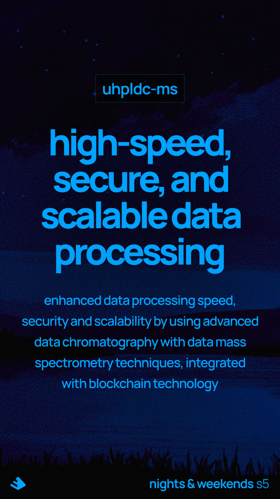

<!-- markdownlint-disable-next-line MD041 -->


## Introduction

**Big data processing based on first principles and system thinking.**

**U**ltra-**H**igh **P**erformance **L**iquid **D**ata **C**hromatography --with-- **M**ass **S**pectrometry

Azure + Synapse + LLMs + Corda = uhpldc-ms

For more details see the [whitepaper](docs/whitepaper/whitepaper_to_be_pdf.md), [faq](docs/faq.md) and [docs](docs/).

## Prerequisites

Before you begin, ensure you have the following installed:

- [Azure CLI](https://docs.microsoft.com/en-us/cli/azure/install-azure-cli)

and that you are logged in into your subscrition:

```sh
az login
```

## Installation

Follow these steps to set up and deploy the infrastructure:

Ensure you are authenticated to Azure CLI before running the commands. You can authenticate using Azure Active Directory (Azure AD) or provide storage account credentials.

### Using azure resource manager (work in progress)

1. **Authenticate using Azure AD**:

    ```sh
    az login
    ```

2. **Open scripts/deploy and adjust the parameters**
3. **run the script**

```sh
./scripts/deploy.sh
```

### Teardown

```sh
./scripts/teardown.sh
```

## Additional Information

For more detailed instructions and information, refer to the documentation provided in the repository.
